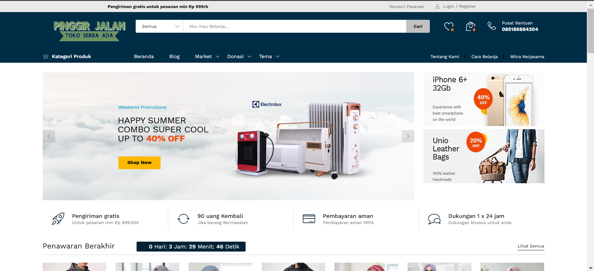
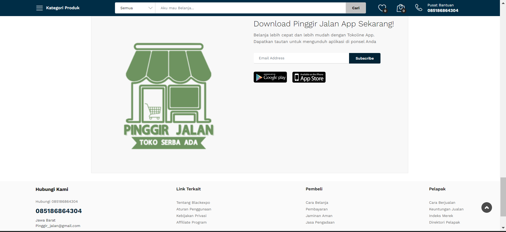
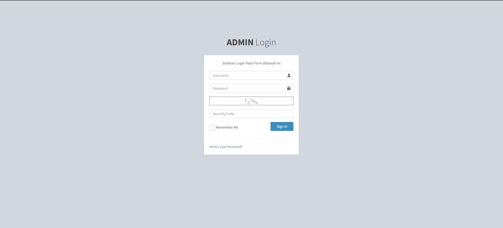
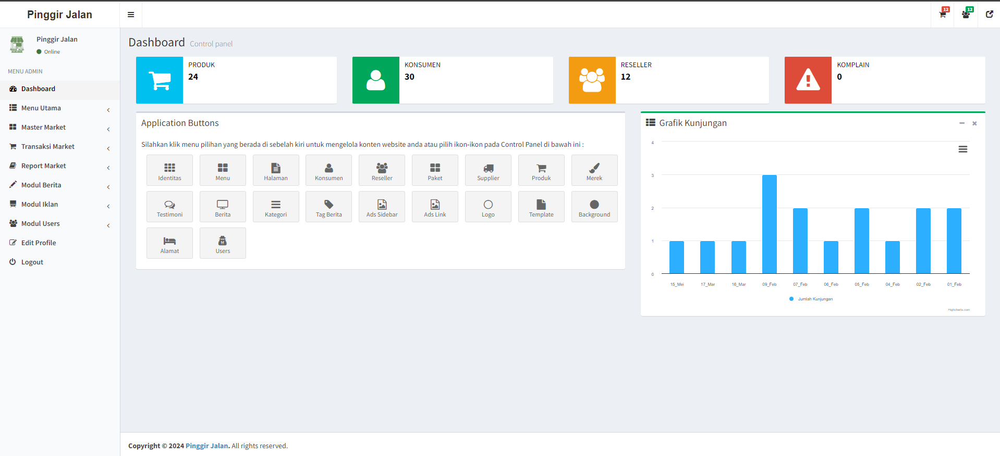
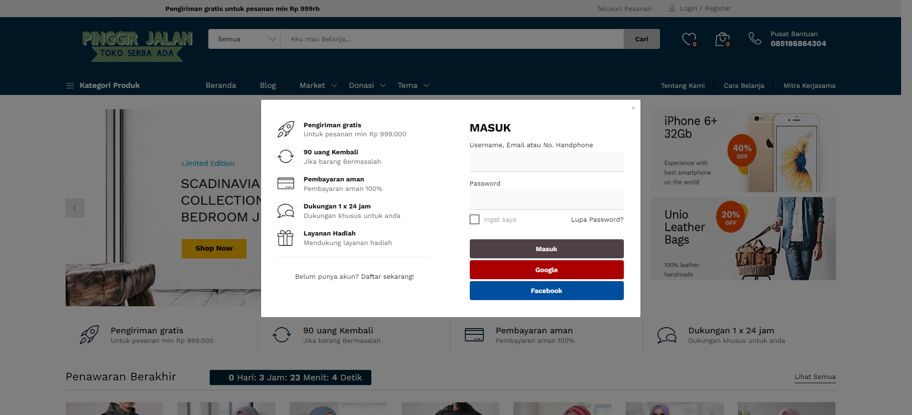
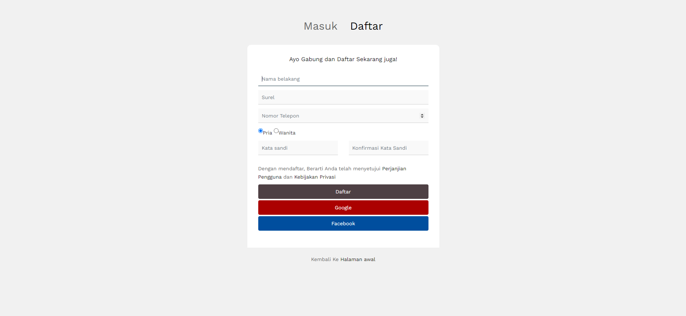
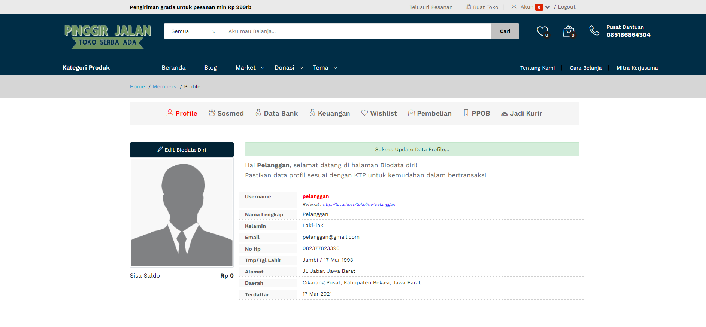

| Nama      | Muhammad Din Al Ayubi |
| ----------- | ----------- |
| NIM     | 312210293       |
| Kelas   | TI.22.A.3        |
| Tugas   | UTS BISNIS ELEKRONIK       |

# Marketplace Pinggir Jalan


```bash
 - Cek Pembayaran Otomatis dan Eksekusi via Mutasibank.co.id
 - Terintegrasi Payment Gateway iPaymu
 - Terintegrasi WA Gateway Wablas (Notifikasi Transaksi via WA)
 - Terintegrasi PPOB Tripay.id
 - Terintegrasi Rajaongkir Pro
 - Terintegrasi Binderbyte (Cek Resi Alternatif untuk jne, tiki, rpx, pandu)
 - Terintegrasi API Mutasibank.co.id
 - Terintegrasi Email SMTP
 - Sosial Login via Facebook dan Google
 - Fitur Resolution Center
 - Fitur Aktivasi Akun Toko/Pelapak
```
# Fitur Umum


 


# Pelanggan

```bash
 - Frond-end Responsive semua perangkat
 - Akun member/Pembeli dan Toko/Reseller dapat disatukan, pengguna bisa buka toko sendiri di web.
 - Memiliki Fitur Saldo Akun, dan halaman Withdraw (Penarikan Dana Penjualan)
 - Fitur wishlist Produk/order.
 - Setting data Pengirim Email Notifikasi langsung dari admin.
 - Fitur Pencarian rentang harga produk.
 - Flash Deal / Promo Produk Seperti bukalapak.
 - Paket upgrade Star seller, seperti halnya pada Shopee
 - Memiliki Lencana Bintang di Toko
 - Produk Tampil dipencarian utama
 - API Rajaongkir PRO
 - Cek Harga hingga Kecamatan
 - Cek Resi Like Tokopedia
 - API Mutasi bank
 - Bisa Cek Mutasi Rekening bank di admin Marketplace
 - Proses order eksekusi otomatis by system dengan kode unik transfer
 - Batasan waktu / Hitung mundur pembayaran Order seperti marketplace kebanyakan.
 - Register dan Login via Facebook dan Google mail
 - Notifikasi Order via WhatsApp dengan API gateway.
 - Variasi Produk Custom (warna, ukuran, dll) seperti pada shopee.
 - Terintegrasi API WA Gateway untuk Notifikasi Transaksi via Whatsapp
 - Terdapat 6 pilihan warna background.
 - Setting/Filter pilihan kurir expedisi oleh pelapak/toko/reseller.
 - Deposit saldo Akun Konsumen/Pembeli
 - Transaksi Order dengan saldo
 - Integrasi Payment Gateway IPaymu: https://ipaymu.com
 - Support system referral, contoh link referral: https://domain.anda/username_referral
 - Support Kurir Custom (Kurir Internal Marketplace)
 - Support Kupon / Voucher Diskon
 - Resolution Center Seperti Tokopedia
 - Support Dropshipper
 - Support Pre-Order
 - Variasi Produk dan Harga
 - Forum Diskusi
 - Verifikasi KTP
 - OTP via WA dan Email
```
# Halaman Administrator
 
```bash
 - Dashboard
 - Menu Utama
 - Identitas Website
 - Logo Website
 - Background Website
 - Menu Website
 - Halaman Baru
 - E-mail Subscribe
 - Master Market
 - Kelola Konsumen
 - Reseller / Pelapak
 - Sopir / Kurir Internal
 - Paket Reseller
 - Kelola Supplier
 - Kategori Produk
 - Sub-Kategori Produk
 - Merek Produk
 - Kelola Produk
 - Rekening Perusahaan
 - Image Slider
 - Margin PPOB
 - Ongkir Kurir Internal
 - Kurir Rajaongkir
 - Transaksi Market
 - Flash Deal / Penawaran
 - Perusahaan ke Supplier
 - Penjualan ke Reseller
 - Pembayaran Reseller
 - Penjualan ke Konsumen
 - Komplain Orders
 - Konf. Order Konsumen
 - Data Mutasi Bank
 - Trans. Withdraw
 - Trans. Paket Reseller
 - Rekap Transaksi Reseller
 - Testimoni Konsumen
 - Modul Berita
 - Kelola Berita
 - Kategori Berita
 - Tag Berita
 - Modul Iklan
 - Iklan Popup
 - Iklan Home
 - Iklan Sidebar
 - Iklan Link
 - Manajemen User
 - Manajemen Modul
 - Edit Profil
```
# Presentasi
[](https://youtu.be/WKKpTRuHL64)
